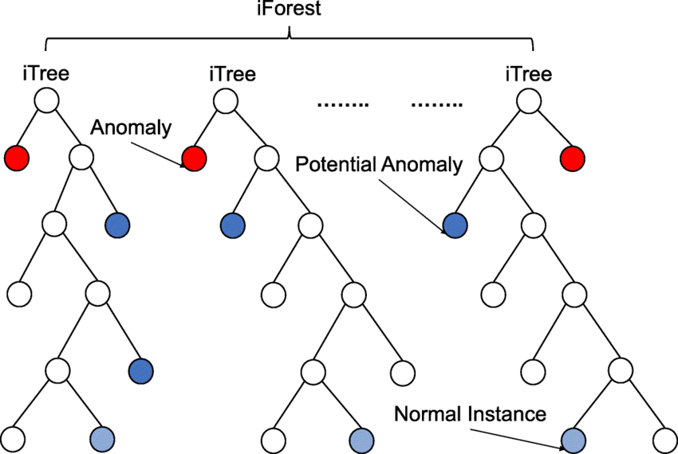

# Novelty and anomaly detection

## Аннотация

Обнаружение аномалий - это метод, используемый в анализе данных для выявления редких элементов, событий или наблюдений, которые значительно отклоняются от большинства данных и не соответствуют четко определенному понятию нормального поведения. Такие аномалии могут указывать на то, что они были порождены другим механизмом или выглядят несовместимыми с остальным набором данных. Обнаружение аномалий применимо в широком спектре областей, включая обнаружение вторжений в кибербезопасность, выявление мошенничества, обнаружение неисправностей, мониторинг состояния системы, обнаружение событий в сенсорных сетях, обнаружение нарушений в экосистеме, обнаружение дефектов на изображениях с помощью машинного зрения, медицинскую диагностику и правоохранительную деятельность.

Обнаружение аномалий - это важная область машинного обучения, и она имеет множество применений для выявления и смягчения последствий подозрительных действий, которые выходят за рамки установленных нормальных моделей поведения. Обнаружение аномалий является критически важной практикой, поскольку они могут быть индикаторами нарушения безопасности, проблем с оборудованием или программным обеспечением, изменения требований клиентов или любых других проблем, требующих немедленного внимания.

Существует три широкие категории методов обнаружения аномалий: supervised, semi-supervised и unsupervised.

- Supervised методы обнаружения аномалий категории  требуют набора данных, которые были помечены как "нормальные" и "аномальные", и включают обучение классификатора. Однако этот подход редко используется при обнаружении аномалий из-за общей недоступности помеченных данных и несбалансированности классов.

- Semi-supervised методы обнаружения аномалий предполагают, что некоторая часть данных помечена. Это может быть любая комбинация нормальных или аномальных данных, но чаще всего методы строят модель, представляющую нормальное поведение, на основе заданного нормального набора обучающих данных, а затем проверяют вероятность того, что тестовый экземпляр будет сгенерирован моделью.

- Unsupervised методы обнаружения аномалий предполагают, что данные не имеют меток, и являются наиболее часто используемыми в связи с их более широким и актуальным применением.

Процесс обнаружения аномалий вращается вокруг использования статистических инструментов и других методик, применяемых к метрикам или набору данных. Методы машинного обучения также становятся все более важными для обнаружения аномалий, поскольку наборы данных становятся очень большими и сложными.

## Датасеты

### [Синтетически сгенерированные нормально распределенные данные](https://numpy.org/doc/stable/reference/random/generated/numpy.random.normal.html)
Среднее = 0  
Стандартное отклонение = 1


### [SKAB](https://github.com/waico/SKAB#datasets)
Корпус SKAB v0.9 содержит 35 отдельных файлов данных в формате .csv. Каждый файл представляет собой один эксперимент и содержит одну аномалию. Набор данных представляет собой многомерный временной ряд, собранный с датчиков, установленных на испытательном стенде


### [Pageblocks](https://github.com/xuhongzuo/deep-iforest/blob/main/data/tabular/pageblocks_16.csv)
Из работы "Deep Isolation Forest for Anomaly Detection" опубликованной в TKDE (апрель 2023). (https://arxiv.org/abs/2206.06602 или https://ieeexplore.ieee.org/document/10108034/)


### [Shuttle](https://github.com/xuhongzuo/deep-iforest/blob/main/data/tabular/shuttle_16.csv)
Из работы "Deep Isolation Forest for Anomaly Detection" опубликованной в TKDE (апрель 2023). (https://arxiv.org/abs/2206.06602 или https://ieeexplore.ieee.org/document/10108034/)


## Использованные методы поиска аномалий

### [3 sigma](https://github.com/rufous86/novelty_detection_qw/blob/main/three_sigma.ipynb)


Один из оригинальных методов поиска аномалий в данных - метод 3 сигма. Он основан на предположении, что большинство значений распределения лежит в пределах 3 стандартных отклонений от среднего значения, то есть находится в интервале (μ - 3σ, μ + 3σ), где μ - среднее значение ряда, а σ - стандартное отклонение. Значения, выходящие за пределы этого интервала, можно считать аномальными.

Принцип метода 3 сигма можно описать следующим образом:

1. Вычисляем среднее значение и стандартное отклонение распределения.
2. Определяем интервал, в пределах которого лежат большинство значений: (μ - 3σ, μ + 3σ).
3. Определяем, какие значения не попадают в этот интервал.
4. Считаем такие значения аномальными.


### [Isolation Forest](https://github.com/rufous86/novelty_detection_qw/blob/main/ml_iForest.ipynb)



Isolation Forest основан на принципе случайного разбиения пространства признаков, что позволяет отделить аномальные точки от нормальных данных. Принцип работы Isolation Forest можно описать следующими шагами:

1. Из набора данных случайным образом выбирается признак, и для него выбирается случайный порог.
2. Данные разбиваются на две группы в соответствии с порогом: точки, которые находятся выше порога, и точки, которые находятся ниже порога.
3. Шаги 1-2 повторяются до тех пор, пока каждая точка не будет отделена от остальных.
4. Для каждой точки определяется, сколько раз ей потребовалось разбиений, чтобы быть отделенной. Чем меньше разбиений потребовалось, тем более аномальной считается точка.

Таким образом, Isolation Forest находит аномалии путем изоляции точек, которые требуют меньше разбиений для отделения от остальных данных. Он может распознавать как изолированные точки с низкой локальной плотностью, так и кластеры аномалий малых размеров. Isolation Forest может использоваться для предварительной оценки и поиска проблемных сервисов, параметры качества которых отклоняются от параметров большинства других сервисов. Однако, отнесение сервиса к аномальным не дает однозначной оценки для сервиса, что он является «плохим», и решать, можно ли на основании этих отклонений считать сервис проблемным, должен уже аналитик.


### [One-SVM](https://github.com/rufous86/novelty_detection_qw/blob/main/ml_OneClassSVM.ipynb)


Принцип метода One-SVM заключается в том, чтобы найти гиперплоскость, которая разделяет нормальные данные от аномалий. Гиперплоскость строится таким образом, чтобы минимизировать ошибки на обучающих данных и максимизировать расстояние между гиперплоскостью и ближайшими точками данных.

Основные шаги метода One-SVM:

Обучение модели на нормальных данных. В этом случае аномалии не используются при обучении модели.
Поиск аномалий в тестовых данных. Если точка данных находится далеко от гиперплоскости, то она считается аномалией.

Например, если у нас есть временной ряд, то мы можем использовать One-SVM для поиска аномалий в этом ряде. Мы можем обучить модель на нормальных данных (к примеру, на первых 80% временного ряда) и затем использовать ее для поиска аномалий в тестовых данных (оставшиеся 20% временного ряда). Если точка данных находится далеко от гиперплоскости, то она считается аномалией.

Преимущества метода One-SVM:

- Метод не требует большого количества размеченных данных, так как использует только нормальные данные.
- Метод хорошо работает с многомерными данными.
- Метод может обнаруживать аномалии, которые находятся далеко от нормальных данных.

Недостатки метода One-SVM:

- Метод может неправильно классифицировать аномалии, которые находятся близко к нормальным данным.
- Метод может быть чувствителен к выбросам в нормальных данных.


### [PCA](https://github.com/rufous86/novelty_detection_qw/blob/main/pca.ipynb)


Метод главных компонент (PCA) - это статистический метод уменьшения размерности данных, который позволяет сократить количество переменных, т.е. признаков, в данных. Он основан на нахождении линейно некоррелированных переменных, называемых главными компонентами. PCA очень часто используется в статистике и машинном обучении, поскольку помогает выделить наиболее значимую информацию из всего датасета, который может состоять из сотни признаков.

Принцип метода поиска аномалий с использованием PCA можно описать следующим образом:

1. Данные выражаются в виде ортонормированных векторов, т.е. угол между ними равен 90°. Это реализуется за счет вычисления собственных векторов (eigenvectors).
2. Собственные векторы сортируются в порядке важности, путем рассмотрения вклада каждого в разброс данных в целом.
3. Выбираются только самые важные компоненты, т.е. те, которые объясняют данные более полно, чем остальные. А поскольку они уже сортированы, то выбираются первые .
4. На основе выбранных главных компонент строится новое пространство признаков, в котором каждый объект представлен более компактно, чем в исходном пространстве признаков. Объекты, которые находятся далеко от центра облака точек в новом пространстве, могут быть считаться аномальными.

Таким образом, PCA может использоваться для поиска аномалий в данных. Однако, важно помнить, что PCA является методом уменьшения размерности, и при его использовании может происходить потеря информации. Поэтому, перед применением PCA для поиска аномалий, необходимо тщательно оценить, насколько важна каждая переменная в данных и какие признаки могут быть исключены без потери важной информации.

Работа алгоритма:
1. Мы загружаем набор данных и применяем PCA для уменьшения размерности данных до 2 измерений. 
2. Затем мы реконструируем данные, используя уменьшенную размерность, и вычисляем остатки. 
3. Мы задаем пороговое значение для остатков, чтобы отличить нормальные и аномальные точки данных. 
4. Мы определяем аномальные точки данных, у которых остатки превышают пороговое значение.

https://towardsdatascience.com/detect-anomalies-in-telemetry-data-using-principal-component-analysis-98d6dc4bf843


### [Local Outlier Factor (LOF)](https://github.com/rufous86/novelty_detection_qw/blob/main/ml_semi_lof.ipynb)


Local Outlier Factor (LOF) основывается на концепции поиска ближайшего соседа и рассчитывает локальное отклонение плотности точки по отношению к ее соседям. LOF используется для обнаружения выбросов и «новизны» - объектов, которые отличаются от других объектов выборки.

LOF оценивает плотность распределения объектов выборки. Если точка имеет мало ближайших соседей, это означает, что она находится в области с малой плотностью, что делает ее потенциальной аномалией. Если точка имеет много ближайших соседей, это означает, что она находится в области с высокой плотностью, и, следовательно, не является аномалией.

По умолчанию LOF предназначен только для обнаружения выбросов (novelty=False). Установив значение novelty в True, можно использовать LOF для обнаружения новизны. В этом случае следует помнить, что использовать функции predict, decision_function и score_samples можно только на новых невидимых данных, а не на обучающем множестве, а результаты, полученные таким образом, могут отличаться от стандартных результатов LOF ([тык](https://scikit-learn.org/stable/modules/generated/sklearn.neighbors.LocalOutlierFactor.html)).


### [ECOD](https://github.com/rufous86/novelty_detection_qw/blob/main/ecod.ipynb)


Алгоритм ECOD (Empirical Cumulative Distribution-based Outlier Detection) - это метод обнаружения выбросов без учителя, который решает такие проблемы, как высокие вычислительные затраты, сложная настройка гиперпараметров и ограниченная интерпретируемость существующих подходов, особенно для больших, высокоразмерных наборов данных. Алгоритм основан на идее, что выбросы часто являются "редкими событиями", появляющимися в хвостах распределения.

ECOD работает в три основных этапа:

1. Оценить базовое распределение: ECOD вычисляет эмпирическую кумулятивную функцию распределения (ECDF) для каждого измерения входных данных непараметрическим способом.

2. Оценить вероятность хвоста: Используя вычисленные ECDF, ECOD оценивает хвостовые вероятности для каждой точки данных в каждом измерении.

3. Вычислить оценки выбросов: ECOD агрегирует оцененные вероятности хвостов по всем измерениям для создания оценки выбросов для каждой точки данных arxiv.org, medium.com.

https://arxiv.org/pdf/2201.00382v3.pdf  
https://paperswithcode.com/paper/ecod-unsupervised-outlier-detection-using

Ключевые преимущества ECOD заключаются в том, что он не требует настройки параметров, прост в интерпретации и, как было показано, превосходит 11 современных базовых моделей по точности, эффективности и масштабируемости. Более того, доступна простая в использовании и масштабируемая реализация на языке Python с распределенной поддержкой.


### [Deep Isolation Forest](https://github.com/xuhongzuo/deep-iforest)

| TO-DO

---
# Допы

**Personal suggestion on selecting an OD algorithm**. If you do not know which algorithm to try, go with:

- [ECOD](https://github.com/yzhao062/pyod/blob/master/examples/ecod_example.py): Example of using ECOD for outlier detection
- [Isolation Forest](https://github.com/yzhao062/pyod/blob/master/examples/iforest_example.py): Example of using Isolation Forest for outlier detection

They are both fast and interpretable. Or, you could try more data-driven approach [MetaOD](https://github.com/yzhao062/MetaOD).

**Outlier Detection with 5 Lines of Code:**

```python
# train an ECOD detector
from pyod.models.ecod import ECOD
clf = ECOD()
clf.fit(X_train)

# get outlier scores
y_train_scores = clf.decision_scores_ # raw outlier scores on the train data
y_test_scores = clf.decision_function(X_test) # predict raw outlier scores on test
```

## SKAB loader

```python
all_files=[]
for root, dirs, files in os.walk("data_labeled/SKAB/"):
    for file in files:
        if file.endswith(".csv"):
             all_files.append(os.path.join(root, file))

# формируем датафрейм
dfs=[]
for path in all_files:
    df = pd.read_csv(path,index_col='datetime',sep=';',parse_dates=True)
    # print(path, df.shape)
    dfs.append(df)
# print('Features:')
# for col in dfs[2].columns:
#     print('\t',col)
dfs = [df for df in dfs if df.shape[1] == 10]
df_skab = pd.concat(dfs)
# print(df_skab.shape)
df_skab = df_skab.drop_duplicates()
df_skab = df_skab.drop('changepoint', axis=1)
display(df_skab)
```

`pageblocks_16.csv` and `shuttle_16.csv` are from https://github.com/xuhongzuo/deep-iforest
Essential info from these datasets:

```python
anom_idx, norm_idx = np.where(y == 1)[0], np.where(y == 0)[0]

x = df.values[:, :-1]
y = np.array(df.values[:, -1], dtype=int)

# data loaders

df_pageblocks = pd.read_csv('data_labeled/pageblocks_16.csv')
df_pageblocks = df_pageblocks.rename(columns={'label': 'anomaly'})
df_shuttle = pd.read_csv('data_labeled/shuttle_16.csv')
df_shuttle = df_shuttle.rename(columns={'label': 'anomaly'})
print('df_pageblocks')
display(df_pageblocks.head())
print('df_shuttle')
display(df_shuttle.head())
```
---
Deep Autoencoding Gaussian Mixture Model for Unsupervised Anomaly Detection:  
[github](https://github.com/danieltan07/dagmm)  
[paperswithcode](https://paperswithcode.com/paper/deep-autoencoding-gaussian-mixture-model-for)  

2018  
The Deep Autoencoding Gaussian Mixture Model (DAGMM) is an unsupervised anomaly detection method that combines deep autoencoders and Gaussian mixture models for density estimation. The method utilizes a deep autoencoder to generate a low-dimensional representation and reconstruction error for each input data point, which is then fed into a Gaussian Mixture Model (GMM) [Source 4](https://paperswithcode.com/paper/deep-autoencoding-gaussian-mixture-model-for).

Instead of using a decoupled two-stage training process and the standard Expectation-Maximization (EM) algorithm, DAGMM jointly optimizes the parameters of the deep autoencoder and the mixture model simultaneously in an end-to-end fashion. This is facilitated by a separate estimation network that helps in the parameter learning of the mixture model [Source 4](https://paperswithcode.com/paper/deep-autoencoding-gaussian-mixture-model-for).

The joint optimization balances autoencoding reconstruction, density estimation of latent representation, and regularization. This helps the autoencoder escape from less attractive local optima and further reduce reconstruction errors, avoiding the need for pre-training [Source 4](https://paperswithcode.com/paper/deep-autoencoding-gaussian-mixture-model-for).

Experimental results on several public benchmark datasets show that DAGMM significantly outperforms state-of-the-art anomaly detection techniques, achieving up to a 14% improvement based on the standard F1 score [Source 4](https://paperswithcode.com/paper/deep-autoencoding-gaussian-mixture-model-for).
