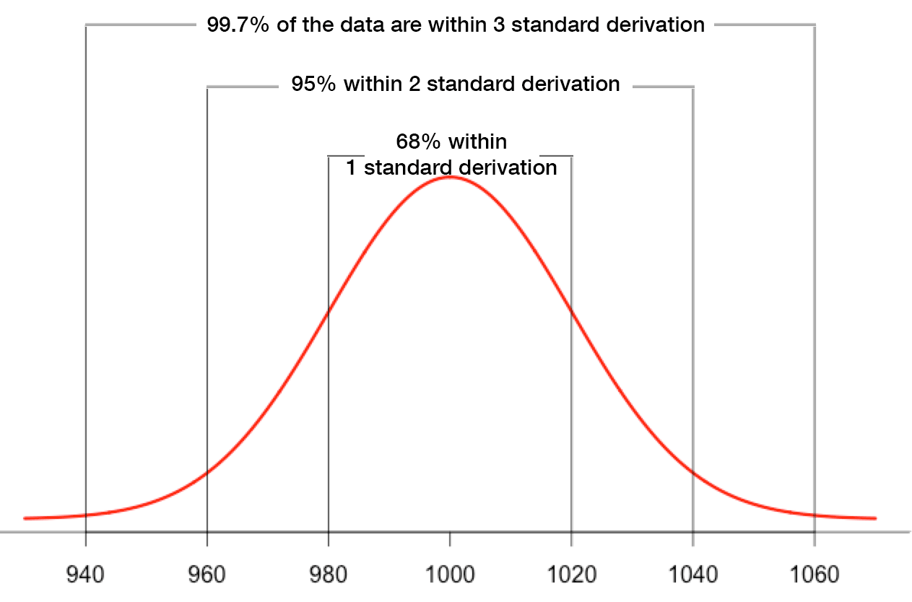

# novelty-detection

### [3 sigma](https://github.com/mipt-nd/novelty-detection/blob/ml_and_stat_methods/three_sigma.ipynb)


Один из оригинальных методов поиска аномалий в данных - метод 3 сигма. Он основан на предположении, что большинство значений распределения лежит в пределах 3 стандартных отклонений от среднего значения, то есть находится в интервале (μ - 3σ, μ + 3σ), где μ - среднее значение ряда, а σ - стандартное отклонение. Значения, выходящие за пределы этого интервала, можно считать аномальными.

Принцип метода 3 сигма можно описать следующим образом:

1. Вычисляем среднее значение и стандартное отклонение распределения.
2. Определяем интервал, в пределах которого лежат большинство значений: (μ - 3σ, μ + 3σ).
3. Определяем, какие значения не попадают в этот интервал.
4. Считаем такие значения аномальными.

### [IForest](https://github.com/mipt-nd/novelty-detection/blob/ml_and_stat_methods/ml_iForest.ipynb)

Isolation Forest основан на принципе случайного разбиения пространства признаков, что позволяет отделить аномальные точки от нормальных данных. Принцип работы Isolation Forest можно описать следующими шагами:

1. Из набора данных случайным образом выбирается признак, и для него выбирается случайный порог.
2. Данные разбиваются на две группы в соответствии с порогом: точки, которые находятся выше порога, и точки, которые находятся ниже порога.
3. Шаги 1-2 повторяются до тех пор, пока каждая точка не будет отделена от остальных.
4. Для каждой точки определяется, сколько раз ей потребовалось разбиений, чтобы быть отделенной. Чем меньше разбиений потребовалось, тем более аномальной считается точка.

Таким образом, Isolation Forest находит аномалии путем изоляции точек, которые требуют меньше разбиений для отделения от остальных данных. Он может распознавать как изолированные точки с низкой локальной плотностью, так и кластеры аномалий малых размеров. Isolation Forest может использоваться для предварительной оценки и поиска проблемных сервисов, параметры качества которых отклоняются от параметров большинства других сервисов. Однако, отнесение сервиса к аномальным не дает однозначной оценки для сервиса, что он является «плохим», и решать, можно ли на основании этих отклонений считать сервис проблемным, должен уже аналитик.

### [One-SVM](https://github.com/mipt-nd/novelty-detection/blob/ml_and_stat_methods/ml_OneClassSVM.ipynb)

Принцип метода One-SVM заключается в том, чтобы найти гиперплоскость, которая разделяет нормальные данные от аномалий. Гиперплоскость строится таким образом, чтобы минимизировать ошибки на обучающих данных и максимизировать расстояние между гиперплоскостью и ближайшими точками данных.

Основные шаги метода One-SVM:

Обучение модели на нормальных данных. В этом случае аномалии не используются при обучении модели.
Поиск аномалий в тестовых данных. Если точка данных находится далеко от гиперплоскости, то она считается аномалией.

Например, если у нас есть временной ряд, то мы можем использовать One-SVM для поиска аномалий в этом ряде. Мы можем обучить модель на нормальных данных (к примеру, на первых 80% временного ряда) и затем использовать ее для поиска аномалий в тестовых данных (оставшиеся 20% временного ряда). Если точка данных находится далеко от гиперплоскости, то она считается аномалией.

Преимущества метода One-SVM:

- Метод не требует большого количества размеченных данных, так как использует только нормальные данные.
- Метод хорошо работает с многомерными данными.
- Метод может обнаруживать аномалии, которые находятся далеко от нормальных данных.

Недостатки метода One-SVM:

- Метод может неправильно классифицировать аномалии, которые находятся близко к нормальным данным.
- Метод может быть чувствителен к выбросам в нормальных данных.

### [PCA](https://github.com/mipt-nd/novelty-detection/blob/ml_and_stat_methods/pca.ipynb)

Метод главных компонент (PCA) - это статистический метод уменьшения размерности данных, который позволяет сократить количество переменных, т.е. признаков, в данных. Он основан на нахождении линейно некоррелированных переменных, называемых главными компонентами. PCA очень часто используется в статистике и машинном обучении, поскольку помогает выделить наиболее значимую информацию из всего датасета, который может состоять из сотни признаков [[4](https://spark-school.ru/blogs/pca-spark/)].

Принцип метода поиска аномалий PCA можно описать следующим образом:

1. Данные выражаются в виде ортонормированных векторов, т.е. угол между ними равен 90°. Это реализуется за счет вычисления собственных векторов (eigenvectors) [[4](https://spark-school.ru/blogs/pca-spark/)].
2. Собственные векторы сортируются в порядке важности, путем рассмотрения вклада каждого в разброс данных в целом [[4](https://spark-school.ru/blogs/pca-spark/)].
3. Выбираются только самые важные компоненты, т.е. те, которые объясняют данные более полно, чем остальные. А поскольку они уже сортированы, то выбираются первые [[4](https://spark-school.ru/blogs/pca-spark/)].
4. На основе выбранных главных компонент строится новое пространство признаков, в котором каждый объект представлен более компактно, чем в исходном пространстве признаков. Объекты, которые находятся далеко от центра облака точек в новом пространстве, могут быть считаться аномальными [[1](https://machinelearningmastery.ru/how-to-use-machine-learning-for-anomaly-detection-and-condition-monitoring-6742f82900d7/)].

Таким образом, PCA может использоваться для поиска аномалий в данных. Однако, важно помнить, что PCA является методом уменьшения размерности, и при его использовании может происходить потеря информации. Поэтому, перед применением PCA для поиска аномалий, необходимо тщательно оценить, насколько важна каждая переменная в данных и какие признаки могут быть исключены без потери важной информации [[4](https://spark-school.ru/blogs/pca-spark/)].

Работа алгоритма:
1. Мы загружаем набор данных и применяем PCA для уменьшения размерности данных до 2 измерений. 
2. Затем мы реконструируем данные, используя уменьшенную размерность, и вычисляем остатки. 
3. Мы задаем пороговое значение для остатков, чтобы отличить нормальные и аномальные точки данных. 
4. Мы определяем аномальные точки данных, у которых остатки превышают пороговое значение.


### [Local Outlier Factor (LOF)](https://github.com/mipt-nd/novelty-detection/blob/ml_and_stat_methods/ml_semi_lof.ipynb)

Local Outlier Factor (LOF) основывается на концепции поиска ближайшего соседа и рассчитывает локальное отклонение плотности точки по отношению к ее соседям. LOF используется для обнаружения выбросов и «новизны» - объектов, которые отличаются от других объектов выборки.

LOF оценивает плотность распределения объектов выборки. Если точка имеет мало ближайших соседей, это означает, что она находится в области с малой плотностью, что делает ее потенциальной аномалией. Если точка имеет много ближайших соседей, это означает, что она находится в области с высокой плотностью, и, следовательно, не является аномалией.

По умолчанию LOF предназначен только для обнаружения выбросов (novelty=False). Установив значение novelty в True, можно использовать LOF для обнаружения новизны. В этом случае следует помнить, что использовать функции predict, decision_function и score_samples можно только на новых невидимых данных, а не на обучающем множестве, а результаты, полученные таким образом, могут отличаться от стандартных результатов LOF [[1](https://scikit-learn.org/stable/modules/generated/sklearn.neighbors.LocalOutlierFactor.html)].

---

**Personal suggestion on selecting an OD algorithm**. If you do not know which algorithm to try, go with:

- [ECOD](https://github.com/yzhao062/pyod/blob/master/examples/ecod_example.py): Example of using ECOD for outlier detection
- [Isolation Forest](https://github.com/yzhao062/pyod/blob/master/examples/iforest_example.py): Example of using Isolation Forest for outlier detection

They are both fast and interpretable. Or, you could try more data-driven approach [MetaOD](https://github.com/yzhao062/MetaOD).

**Outlier Detection with 5 Lines of Code:**

```python
# train an ECOD detector
from pyod.models.ecod import ECOD
clf = ECOD()
clf.fit(X_train)

# get outlier scores
y_train_scores = clf.decision_scores_ # raw outlier scores on the train data
y_test_scores = clf.decision_function(X_test) # predict raw outlier scores on test
```

## SKAB loader

```python
all_files=[]
for root, dirs, files in os.walk("data_labeled/SKAB/"):
    for file in files:
        if file.endswith(".csv"):
             all_files.append(os.path.join(root, file))

# формируем датафрейм
dfs=[]
for path in all_files:
    df = pd.read_csv(path,index_col='datetime',sep=';',parse_dates=True)
    # print(path, df.shape)
    dfs.append(df)
# print('Features:')
# for col in dfs[2].columns:
#     print('\t',col)
dfs = [df for df in dfs if df.shape[1] == 10]
df_skab = pd.concat(dfs)
# print(df_skab.shape)
df_skab = df_skab.drop_duplicates()
df_skab = df_skab.drop('changepoint', axis=1)
display(df_skab)
```

`pageblocks_16.csv` and `shuttle_16.csv` are from https://github.com/xuhongzuo/deep-iforest
Essential info from these datasets:

```python
anom_idx, norm_idx = np.where(y == 1)[0], np.where(y == 0)[0]

x = df.values[:, :-1]
y = np.array(df.values[:, -1], dtype=int)

# data loaders

df_pageblocks = pd.read_csv('data_labeled/pageblocks_16.csv')
df_pageblocks = df_pageblocks.rename(columns={'label': 'anomaly'})
df_shuttle = pd.read_csv('data_labeled/shuttle_16.csv')
df_shuttle = df_shuttle.rename(columns={'label': 'anomaly'})
print('df_pageblocks')
display(df_pageblocks.head())
print('df_shuttle')
display(df_shuttle.head())
```
